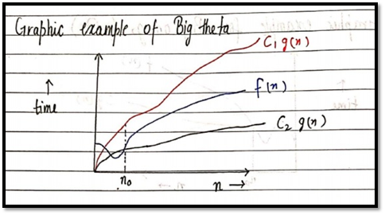

# ---------Asymptotic Notations----------
Asymptotic notation gives us an idea about how good a given algorithm is compared to some other
algorithm. 
Let us see the mathematical definition of “order of” now, 
Primarily there are three types of widely used asymptotic notations.
<ol>
<li> Big oh notation ( O )</li>
<li> Big omega notation ( Ω )</li>
<li> Big theta notation ( θ ) – Widely used one </li>
</ol>

## Big oh notation
Big oh notation is used to describe asymptotic upper bound.  
Mathematically, if f(n) describes running time of an algorithm; f(n) is O(g(n)) if there exist positive constants
C and no such that,  
O ≤ f(n) ≤ c g(n)   for all n ≥ no  
[It is used to give upper bound on a function]
 
If a function is O(n), it is automatically O(n2) as well!  
<b>
Graphic example for Big oh ( O ):</b>

## Big Omega Notation ( Ω )

Just like O notation provides an asymptotic upper bound, Ω notation provides asymptotic lower bound.   Let f(n) define the running time of an algorithm; 
F(x) is said to be Ω (gx) if there exist positive constants C and no such that, 
O ≤ c g(x) ≤ f(x)                  for all n ≥ no                  (used to give lower bound on a function) 
If a function is Ω (n2) it is automatically Ω (n) as well. 
<b> Graphic example for Big Omega (Ω)</b>

## Big theta notation ( θ )
Let f(x) define running time of an algorithm
F(x) is said to be θ (gx) if f(x) is O (g(x)) and f(x) is Ω (g(x)). 
Mathematically, 

The equation simply means there exist positive constants C1 and C2 such that f(x) is sandwiched between C2 g(x) and C1 g(x).   
<b>
Graphic example of Big theta ( θ )
</b>

## Which one of these to use?

Since Big theta gives a better picture of run time for a given algorithm, most of the interviewers expect you to provide an answer in terms of Big theta when they say “order of”. 

<b>Quick Quiz:</b> Prove that n2+n+1 is O(n3), Ω(n2), and θ(n2) using respective definitions.

 

### Increasing order of common runtimes
