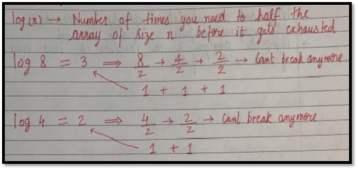

# Best Worst and Expected Case
Sometimes we get lucky in life. Exams canceled when you were not prepared, a surprise test when you were prepared, etc.   → <b>Best case</b>
  
Sometimes we get unlucky. Questions you never prepared asked in exams, rain during the sports period, etc.  → <b>Worst case</b>
  
But overall the life remains balanced with the mixture of lucky and unlucky times.  → <b>Expected case</b>
  

## Analysis of a search algorithm:
Consider an array that is sorted in increasing order.

[1, 7, 18, 28, 50, 180] 
We have to search a given number in this array and report whether it’s present in the array or not.

### Algo 1 – 
Start from the first element until an element greater than or equal to the number to be searched is found.
### Algo 2 – 
Check whether the first or the last element is equal to the number. If not find the number between these two elements (center of the array) if the center element is greater than the number to be searched, repeat the process for the first half else repeat for the second half until the number is found.

 

### <b>Analyzing Algo 1</b>
If we really get lucky, the first element of the array might turn out to be the element we are searching for. Hence we made just one comparison.

Best case complexity = O(1)

If we are unlucky, the element we are searching for might be the last one.

Worst-case complexity = O(n)

For calculating the average case time, we sum the list of all the possible case’s runtime and divide it with the total number of cases. <b>(Sometimes calculation of average-case time gets very complicated)
 </b>

### <b>Analyzing Algo 2<b>
If we get really lucky, the first element will be the only one which gets compared

Best case complexity = O(1)

If we get unlucky, we will have to keep dividing the array into halves until we get a single element (the array gets finished)

Worst-case complexity = O(log n)

 

## What log(n)? What is that?
Log n simply means how many times I need to divide n units such that we cannot divide them (into halves) anymore.
  

  

# Space Complexity
Time is not the only thing we worry about while analyzing algorithms. Space is equally important.

Creating an array of size n (size of the input) → O (n) Space

 
If a function calls itself recursively n times its space complexity is O (n). :)

 
 
 
<b>Quiz Quiz:</b> Calculate space complexity of a function that calculates the factorial of a given number n.

   

### Why can’t we calculate complexity in seconds?

→Not everyone’s computer is equally powerful.

→Asymptotic analysis is the measure of how time (runtime) grows with input.